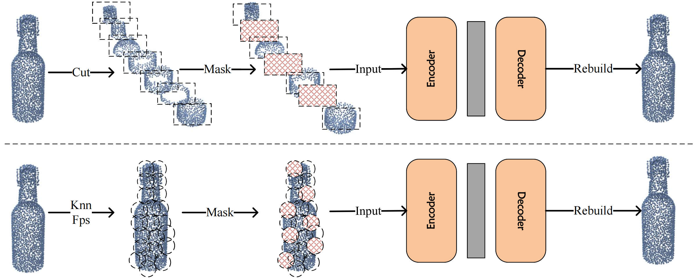
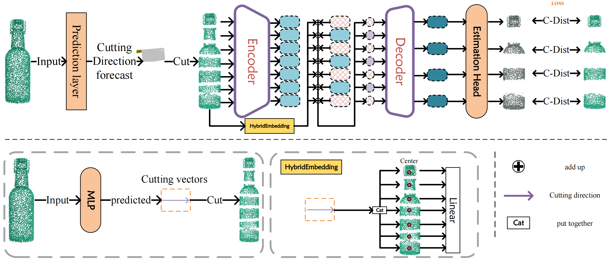

# Point-Cut

## Enhancing Point Cloud Robustness through Cylindrical Coordinate Masking in PointCut

Masked autoencoders (MAE) have demonstrated impressive performance in both natural language processing and computer vision, showcasing their potential across various applications. Building on this success, we have developed a novel self-supervised learning framework called PointCut, designed to address challenges in point cloud data processing, such as uneven grouping and data representation issues.
The core innovation of PointCut lies in its cutting plane generation technique. By converting point cloud data into cylindrical coordinates and sorting it based on projection distances, we create optimal cutting planes for each point cloud cluster. This method enhances processing efficiency and model robustness through diverse occlusion schemes. Our masking strategy further strengthens the model by applying varying masking ratios to each data patch, improving recovery capability under different levels of information loss.
Through extensive testing and experiments, PointCut has demonstrated promising performance in pre-training and exceptional generalization across various point cloud-related tasks. These results validate our approach's effectiveness in point cloud self-supervised learning and provide valuable insights for overcoming challenges in point cloud data processing.

### Reconstructing point clouds.
<div  align="center">    
 
</div>

### Reconstructing the point cloud of an occluded cut view through a codec
<div  align="center">    
 
</div>

## 1. Requirements

- PyTorch >=2.3.1
- python >= 3.8
- CUDA >= 12.1
- GCC >= 4.9
- torchvision

```
pip install -r requirements.txt

# Chamfer Distance & emd
cd ./extensions/chamfer_dist
python setup.py install --user
cd ./extensions/emd
python setup.py install --user
# PointNet++
pip install "git+https://github.com/erikwijmans/Pointnet2_PyTorch.git#egg=pointnet2_ops&subdirectory=pointnet2_ops_lib"
# GPU kNN
pip install --upgrade https://github.com/unlimblue/KNN_CUDA/releases/download/0.2/KNN_CUDA-0.2-py3-none-any.whl
```

## 2. Datasets
All datasets are in the data directory

### ModelNet40

```
│ModelNet/
├──modelnet40_normal_resampled/
│  ├── modelnet40_shape_names.txt
│  ├── modelnet40_train.txt
│  ├── modelnet40_test.txt
│  ├── modelnet40_train_8192pts_fps.dat
│  ├── modelnet40_test_8192pts_fps.dat
```
Download: You can download the processed data from [Point-BERT repo](https://github.com/lulutang0608/Point-BERT/blob/49e2c7407d351ce8fe65764bbddd5d9c0e0a4c52/DATASET.md), or download from the [official website](https://modelnet.cs.princeton.edu/#) and process it by yourself.

### ShapeNet55/34 Dataset:

```
│ShapeNet55-34/
├──shapenet_pc/
│  ├── 02691156-1a04e3eab45ca15dd86060f189eb133.npy
│  ├── 02691156-1a6ad7a24bb89733f412783097373bdc.npy
│  ├── .......
├──ShapeNet-55/
│  ├── train.txt
│  └── test.txt
```

Download: Please download the data from [Point-BERT repo](https://github.com/lulutang0608/Point-BERT/blob/49e2c7407d351ce8fe65764bbddd5d9c0e0a4c52/DATASET.md).

### ShapeNetPart Dataset:

```
|shapenetcore_partanno_segmentation_benchmark_v0_normal/
├──02691156/
│  ├── 1a04e3eab45ca15dd86060f189eb133.txt
│  ├── .......
│── .......
│──train_test_split/
│──synsetoffset2category.txt
```

Download: Please download the data from [here](https://shapenet.cs.stanford.edu/media/shapenetcore_partanno_segmentation_benchmark_v0_normal.zip). 

## 3. Results of PointCut

### 3D object classification on ModelNet40
|Method| Accuracy(%)|
|:----:|:----:|
|PointCut|91.2|

### Part Segmentation on ShapeNet Part
|Method| Cls. mIoU(%)| Inst. mIoU(%) 
|:----:|:-----:|:-----:|
|PointCut|79.4|83.5|

## 4. Pre-training, Classification and Segmentation of PointCut

### Pre-training

To pretrain PointCut on ShapeNet training set

```
python main.py --config cfgs/pretrain.yaml --exp_name <output_file_name>
```

### 3D object classification on ModelNet40

```
python main.py --config cfgs/finetune_modelnet.yaml --finetune_model --exp_name <output_file_name> --ckpts <path/to/pre-trained/model>
```

### Part segmentation on ShapeNetPart
```
cd segmentation
python main.py --ckpts <path/to/pre-trained/model> --root path/to/data --learning_rate 0.0002 --epoch 300
```

## Acknowledgement

Our codes are built upon [Point-Bert](https://github.com/Julie-tang00/Point-BERT), [Point-MAE](https://github.com/Pang-Yatian/Point-MAE) and [PointGPT](https://github.com/CGuangyan-BIT/PointGPT)